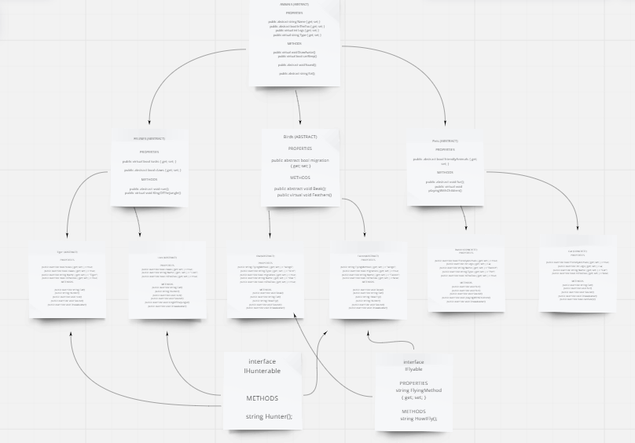
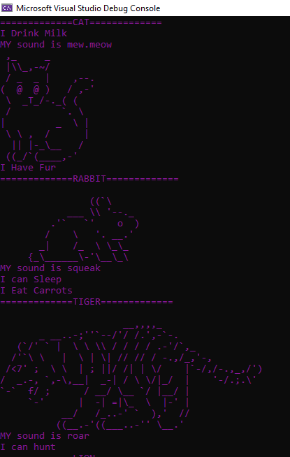
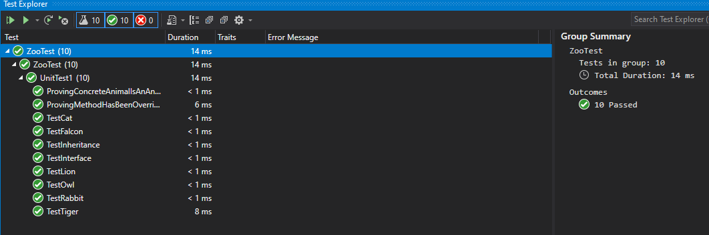

# IBuiltAZoo
A zoo contains animals, and animals can come in many different shapes and sizes. It is your job to plan and build out what animals live in the zoo

## Problem Domain
The contents of this lab will plan and build out what animals live in the zoo. It contains a console app that will instantiate animals and prove that they are inheriting traits and features from their parent classes.

## UML



## Inheritance
Classes can inherit properties and behaviors of base classes. For example, all animals in my zoo inherit the `Eat` and `Sound` property because all of the animals inherit from the base class of `Animal`.
Examples:

```
public override void Sound()
        {
            Console.WriteLine("MY sound is squeak");
        }
```
## Abstraction
Refers to the characteristics of Abstract classes. Abstract classes contain things that are true for all of the ancestors but does not specify any kind of default behavior. The use of an abstract class also requires implementing override.
Examples:

```
    public abstract class Pets : Animal

```

## Polymorphism
The idea that child classes can change behavior by overriding previous/parent behavior in order to reflect their particular abilities.
Examples:

```
Felines lion = new Lion();
            lion.DrawAvatar();
            lion.KIngOfTheJungle();
            lion.run();
```

## Encapsulation
Preventing access to implementation details. By using 'protected' classes, you limit implementation and visibility to only a scope within the class and child classes.
Examples:

```
 protected override void fur()
        {
            Console.WriteLine("I Have Fur");
        }
```

## Interfaces
An interface is a way to group types together by sharing the same kind of inheritance among them. It defines a role that an object can play by specifying a thing that an object is able to do.


## Interface Implementation
> In my project, there are currently 2 interfaces: `IHunterable` and `IFlyable`.
* IHunterable
```
interface IHunterable
    {
        string Hunter();
       

    }
```

* IFlyable
```
interface IFlyable
    {
        string FlyingMethod { get; set; }

        string HowIFly();
    }

```

# visual





